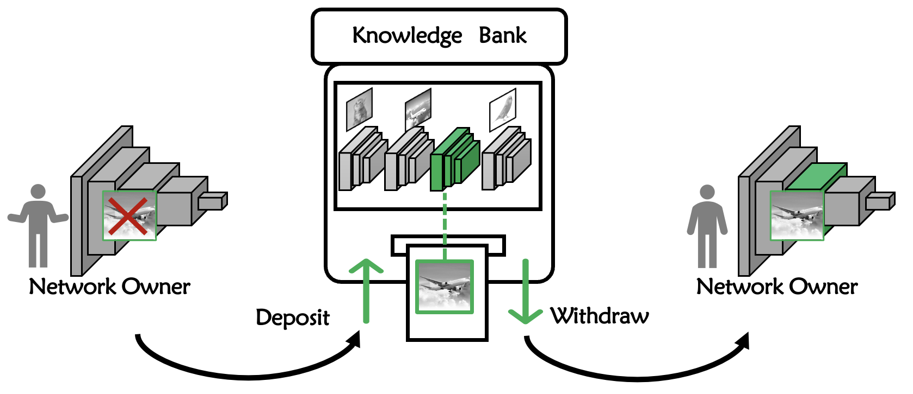

# 知识可取可存！新国立LV lab提出全新可恢复型模型遗忘框架！代码已开源！（ECCV 2022）

本文分享ECCV 2022论文 **『 Learning with Recoverable Forgetting 』**，实现知识在深度模型上的便捷存取。新加坡国立大学LV lab提出全新可恢复型模型遗忘框架！代码已开源！

详细信息如下：

- 论文地址：[https://arxiv.org/abs/2207.08224](https://arxiv.org/abs/2207.08224)
  
- 代码地址：[https://github.com/JngwenYe/LIRF](https://github.com/JngwenYe/LIRF)
  
 
&emsp;

在2022年高分美剧《Severance》中，反派公司研究出一项新技术，通过将芯片植入员工的大脑，进行大脑的记忆控制。一旦员工进入公司，芯片将大脑中关于公司外的记忆暂存，而到了下班时间，芯片恢复该部分的记忆，转而暂存员工在工作时的记忆。该剧被戏称为职场惊悚剧，虽然走的是科幻路线，看似是很超前的剧情设定，但其中的核心技术在本文中已被实现！

&emsp;

&emsp;

本文研究的为在神经网络上的知识灵活存取。网络中的部分知识可以代由“知识银行”进行**暂存**，待到需要时，该部分知识又可被便捷地**取出**，重新在网络上运作。这种知识可存可取性极大地扩宽了终身学习领域，在确保用户自由度的同时也起到了知识保护的目的。

&emsp;

 

**- 01 -**
  
**摘要**

终身学习旨在学习一系列新的任务的同时保留先前获得的知识。然而，由于数据隐私或版权问题，训练数据并不是终身合法的，这时需要诱导模型选择性失忆。

&emsp;

例如在实际场景中，根据模型具体部署的需求，模型所有者可能希望启用或禁用特定任务或特定敏感数据的知识。这需要对模型所学到的知识进行灵活控制，包括删除暂时不需要的部分知识，以及恢复重新恢复使用权的知识。

&emsp;

在本文中，作者探索了一种新颖的学习方式，称为可恢复型遗忘学习（**L**earning w**I**th **R**ecoverable **F**orgetting，LIRF），用于显式处理特定任务或敏感样本知识删除和恢复。

&emsp;

具体地，LIRF定义了两个知识层面的任务，即知识存储和恢复：

- 在**知识存储**阶段，LIRF从目标网络中提取指定的知识并保留在存款模块中；
- 在**知识恢复**阶段，LIRF直接调取存储模块中的知识进行恢复。

训练整个LIRF框架只需要用敏感数据在原始网络上微调几个epoch。大量实验表明LIRF在同时具备数据和计算高效性的同时，也能完美满足文章中定义的知识存取需求。无需任何网络微调操作即可直接恢复已存储的知识，并且恢复后的网络性能相较于原始网络提升**1%～5%**。

&emsp;

 

**- 02 -**
  
**定义**

知识的存取定义如下图所示，$\mathcal{D}$ 表示包含敏感数据的完整数据集，直接在 $\mathcal{D}$ 上训练的原始网络表示为 $\mathcal{T}_ 0$。
将原始数据集 $\mathcal{D}$ 划分为存储集和保留集，其中，
存储集 $\mathcal{D}_ r$ 的知识在目标网络 $\mathcal{T}$ 被删除，并保留在在存款模块 $\mathcal{T}_ r$ 中；保留集 $\overline{\mathcal{D}}_ r$ 为 $\mathcal{D}_ r$ 的补集。

&emsp;

&emsp;

因此 LIRF 所涉及的知识存储和恢复任务可以被定义为：

$$
\mathcal{T}_ 0\xrightarrow[\mathcal{D}_ r]{\text{Deposit}} \{\mathcal{T}, \mathcal{T}_ r\}\xrightarrow{\text{Withdraw}}  \widetilde{{\mathcal{T}}}
$$

&emsp;

**定义一 【存储任务 Deposit】：** 
输出两个模型，一为目标网络 $\mathcal{T}:\mathcal{X}\rightarrow\mathcal{Y}$，对于保留集中的数据 $x\subset\overline{\mathcal{D}}_ r$, 目标网络将输入 $x$ 映射到其正确的类别标签 $y$，对于存储集中的数据 $x\subset\mathcal{D}_ r$，目标网络将输入 $x$ 映射到错误的类别标签；二为存储模块 $\mathcal{T}_ r:\mathcal{X}\rightarrow\mathcal{F}$，用于存储集合 $\mathcal{D}_ r$ 的知识。 

*限制条件：只有原始网络 $\mathcal{T}_ 0$ 和存储集 $\mathcal{D}_ r$ 可供使用。*

&emsp;

**定义二 【恢复任务 Withdraw】：** 
输出复原网络 $\widetilde{{\mathcal{T}}}:\mathcal{X}\rightarrow\mathcal{Y}$。
对于所有数据 $x\subset\mathcal{D}$，复原网络将输入 $x$ 映射到其正确的类标签 $y$。

*限制条件：只有目标网络 $\mathcal{T}$ 和存款模块 $\mathcal{T}_ r$ 可供使用。*

&emsp;

 

**- 03 -**
  
**方法**

**3.1. 目标网络知识滤除**

在知识存储阶段，需要去除目标网络中存储集 $\mathcal{D}_ r$ 的知识同时保持保留集 $\overline{\mathcal{D}}_ r$ 上的性能。

&emsp;

首先，作者将原始网络 $\mathcal{T}_ 0$ 在第 $n$ 个模块处分为浅层模块 $\mathcal{T}_ 0^{(-n)}$ 和 深层模块 $\mathcal{T}_ 0^{(n-)}$，同样在目标网络上也进行同样的划分：$\mathcal{T}=\mathcal{T}^{(-n)}\circ \mathcal{T}^{(n-)}$。
依据该划分策略，作者将原始网络的深层模块完全迁移至目标网络的深层模块中，即 $\mathcal{T}^{(n-)}=\mathcal{T}_ 0^{(n-)}$。因此，接下来只需要进行从 $\mathcal{T}^{(-n)}$ 到 $\mathcal{T}_ 0^{(-n)}$ 的部分迁移操作。

&emsp;

**Sample-specific 知识去除：**
需要在两个方面对 Sample-specific 知识进行去除。
一是目标网络无法对存储集 $\mathcal{D}_ r$ 做出正确的类别标签预测；二是存储集 $\mathcal{D}_ r$ 的知识无法从目标网络 $\mathcal{T}$ 中蒸馏得。

对于每个存储集的输入 $x\subset \mathcal{D}_ r$，作者对其分配一个随机标签 $y_ r$，以此微调目标网络 $\mathcal{T}$，使得目标网络在存储集上做出错误预测结构。
于此同时，作者最大化了目标网络和原始网络浅层模块中间特征的注意力图，用以消除该部分知识的可蒸馏性。该部分损失表示为：
$$\mathcal{L}_ {kr}= \mathcal{L}_ {ce}\big(\mathcal{T}(x),y_ r\big)-\lambda_ {at} \mathcal{L}_ {at}\big(\mathcal{T}^{(-n)}(x),\mathcal{T}_ 0^{(-n)}(x)\big)$$

&emsp;

**General 知识保留：**
目标网络需要保留两部分知识。一是保留集 $\overline{\mathcal{D}}_ r$ 的所有知识，用于维持目标网络在保留集上的性能；
二是来自 $\mathcal{D}_ r$ 的一般性知识，通过保留部分不会泄漏存储集隐私的一般知识，提升目标网络在保留集上的性能。

由于目标网络 $\mathcal{T}$ 由原始网络初始化得，并且目标网络 $\mathcal{T}$ 的深层模块在微调时保持参数固定，因此部分知识已完成从 $\mathcal{T}_ 0^{(n-)}$ 到 $\mathcal{T}^{(n-)}$ 的迁移。
除此之外，作者提出了基于滤波器 $g$ 的知识迁移，以防止在保留集 $\overline{\mathcal{D}}_ r$ 上的灾难性遗忘，即：
$$
    \mathcal{L}_ {kp} = \mathcal{L}_ {kd}\big(g(\frac{z_ {\mathcal{T}}(x)}{T}),g(\frac{z_ {\mathcal{T}_ {0}}(x)}{T})\big),
$$
公式中，过滤器 $g$ 起到选择保留集对应的类别标签的 logits的效果。

&emsp;

**3.2. 存储模块知识存储**

存储模块应该具备两个重要性质：首先为易恢复性，恢复存储模块中的知识不需要额外的计算开销； 其次为易存储性，需设计小规模的存储模块以节省存储空间。

&emsp;

为了减小存储模块的参数规模，作者使用剪枝后的原始网络初始化存款模块 $\mathcal{T}_ r$。此外，作者使用基于过滤器 $\overline{g}$ 的损失函数 $\mathcal{L}_ {pt}$ 进行部分知识转移：
$$
    \mathcal{L}_ {pt} = \mathcal{L}_ {kd}\big(\overline{g}(\frac{z_ {\mathcal{T}_ r\circ\mathcal{T}^{(n-)}}(x)}{T}),\overline{g}(\frac{z_ {\mathcal{T}_ {0}}(x)}{T})\big), 
$$
公式中，过滤器 $\overline{g}$ 起到选择存储集对应的类别标签的 logits的效果。

&emsp;

通过最小化损失 $\mathcal{L}_ {pt}$，可以将特定样本的知识转移到存储模块。同时为了确保存储的知识易于后续的恢复操作，作者进一步微调存储模块 $\mathcal{T}_ r$，使其 easy-to-withdraw。这意味着对于恢复网络 $\widetilde{{\mathcal{T}}}$，知识是可恢复的。因此，在进行知识存储的同时，作者提前考虑其在复原网络 $\mathcal{L}_ {re}$ 上的可恢复性。具体来说，额外引入了与复原网络相关的损失项：
$$
\mathcal{L}_ {re} = \mathcal{L}_ {ce}\big(\widetilde{{\mathcal{T}}}(x),y\big),
$$
在这里，得到的存储模块只用于知识的存储，不能用作独立的预测模型。 因此，敏感知识存储在 $\mathcal{T}_ r$ 中比保留原始图像更为安全。

&emsp;

**3.3. 复原网络知识恢复**

经由之前的两个操作可实现知识的便捷存取。因此恢复知识至复原网络时，知识可以直接使用，无需任何微调以及任何数据。

&emsp;

具体来说，复原网络的组织形式可被表示为：

$$
\widetilde{{\mathcal{T}}}(x)=g\big (\mathcal{T}(x)\big)+ \overline{g}\big ( \mathcal{T}_ r\circ\mathcal{T}^{(n-)}(x)\big),
$$
过滤函数 $g$ 和 $\overline{g}$ 与之前的定义一致。因此训练 LIRF 的损失函数可以表示为各损失项的加权相加：
$$
\mathcal{L}_ {all}= \mathcal{L}_ {kr}+\lambda_ {kp}\mathcal{L}_ {kp}+\lambda_ {re}\mathcal{L}_ {re}+\lambda_ {pt}\mathcal{L}_ {pt},
$$
LIRF 通过在存储集 $\mathcal{D}_ r$ 上的 $\mathcal{L}_ {all}$ 进行网络微调，保留集 $\overline{\mathcal{D}}_ r$ 全程不参与网络更新。

&emsp;

值得注意的是，虽然 LIRF 中的目标网络进行了部分数据遗忘，但其优化目标与 machine unlearning 不同。machine unlearning 旨在获得一个与使用数据 $\overline{\mathcal{D}}_ r$ 重新训练结果一致的目标网络。
而在 LIRF 中，目标网络的知识容量大于仅使用 $\overline{ \mathcal{D}}_ r$ 训练的网络，因为它包含存储集 $\mathcal{D}_ r$ 的一般性知识。 只有与隐私相关的敏感知识保留在存储模块中。
在知识恢复时，复原网络 $\widetilde{\mathcal{T}}$ 不会被强制逼近原网络：$\widetilde{\mathcal {T}}\neq\mathcal{T}_ 0$。 实际上，LIRF 中包含多种知识迁移形式，复原网络的性能相较于原始网络有进一步的性能提升。

&emsp;

 

**- 04 -**
  
**实验**

**4.1. 评价指标**

对知识存取的效果评价，作者主要评估了目标网络和复原网络的性能。
对于复原网络的评估，作者计算了保留集的平均准确率（Pre Acc.）、存储集的平均准确率（Dep Acc.）和完整数据集的平均准确率（Avg Acc.）。
对于目标网络的评估，作者计算了保留集的平均准确率（Pre Acc.）、存储集的平均准确率（Dep Acc.）和同时考虑两者的调和平均数（H Mean）。

&emsp;

**4.2. 实验结果**

CIFAR-10 和 CUB200-2011上的效果如上表所示。由表观察可得，目标网络上的 “Pre Acc.” 相较于原始网络大幅度下降，验证了目标网络的关于存储集在 logit 层次的遗忘。同时与原始网络相比，复原网络在存储集和保留集上都获得了更高的准确性，验证了 LIRF 中存在正向知识迁移。

&emsp;

上表进行了目标网络中存储集的蒸馏性实验验证。从该表中观察可得，目标网络上的保留集的知识可迁移性不受影响，而存储集的知识难以通过 ligit-base 和 attention-base 的蒸馏方式进行迁移。

&emsp;

LIRF 中的网络最后一层特征的可视化结果如上图所示。如图所示，原始网络和复原网络都可以在所有类别上产生具备判别力的特征。对于目标网络，该可视化结果证明了其具备保留集上的高度判别力特征的同时去除了对存储集的预测能力。

&emsp;

 

**- 05 -**
  
**总结**

在本文中，作者探索了一种全新的终身学习任务，进行可恢复型知识遗忘。与以往的终身学习任务不同，该任务设定对知识进行灵活的删除和恢复操作，在增强了用户可操作性的同时确保了网络IP安全。
具体地，作者提出了包括知识存储和知识恢复的 LIRF 框架。在进行知识存储时，可能导致隐私泄露的知识从原始网络中提取，并保存在存储模块中。在进行知识恢复时，存储的知识可直接插入至复原模型中。
作者还进行了大量实验，用以证明 LIRF 的有效性。

&emsp;

**参考资料**

[1] https://arxiv.org/abs/2207.08224

[2] https://github.com/JngwenYe/LIRF
